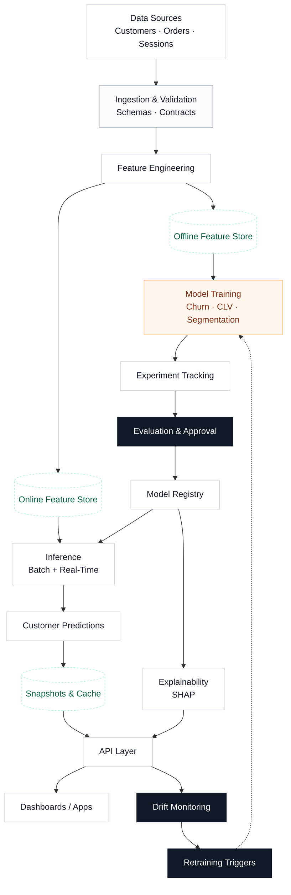

# Customer Intelligence System – Architecture

## Overview

The Customer Intelligence System is a modular, batch-first predictive platform designed to generate **customer-level intelligence signals** such as churn risk, customer lifetime value (CLV), and behavioral segments.

The architecture intentionally separates **data ingestion, feature computation, modeling, and output delivery** to ensure scalability, reproducibility, governance, and long-term maintainability.

---

## High-Level Flow

**Raw Data → Validation → Feature Engineering → Models → Output Surfaces → Consumers**

---

## Core Architectural Layers

1. Data Sources  
2. Data Validation & Normalization  
3. Feature Engineering Layer  
4. Modeling Layer  
5. Output & Consumption Layer  
6. Monitoring & Governance  

---

## Data Sources

The system ingests batch data from multiple upstream systems:

- Orders  
- Sessions  
- Returns  
- Customer Metadata  

All datasets are assumed to be linked via a **stable customer identifier** provided by upstream systems.  
Identity resolution is considered out of scope.

---

## Data Validation & Normalization

Incoming data is validated before any downstream processing to ensure correctness and consistency.

Key responsibilities:
- Schema validation
- Data type enforcement
- Missing value handling
- Basic sanity checks (ranges, null thresholds)

This layer acts as a **data quality gate** for the entire system.

---

## Feature Engineering Layer

The feature engineering layer produces **time-aware, leakage-safe customer features** shared across all models.

Capabilities:
- Time-windowed aggregations (7d / 30d / 90d)
- Snapshot-based feature computation
- Leakage-safe transformations
- Shared feature definitions across models

Features may be optionally backed by a **versioned feature store** to support reproducibility and offline–online consistency.

---

## Modeling Layer

The modeling layer consists of **independent but coordinated models** operating on the shared feature set.

Supported model types:
- Churn prediction (classification or survival analysis)
- Customer Lifetime Value (CLV) estimation (regression or survival)
- Customer segmentation (KMeans / HDBSCAN)
- Optional behavioral embeddings

Models are:
- Trained independently
- Versioned and registered centrally
- Deployed via batch inference pipelines

---

## Output & Consumption Layer

Model outputs are published as **customer-level intelligence artifacts**.

Output surfaces include:
- API: `/customer/profile`
- Analytical tables: `customer_risk_scores`
- Dashboards: Customer Health Overview

All outputs are:
- Versioned
- Timestamped
- Auditable
- Safe for downstream consumption

---

## System Architecture Diagram

## Design Principles

- Time-awareness by default
- Batch-first, API-second
- Privacy-first data usage
- Modular and replaceable components
- Strong observability and auditability

---

## Non-Goals

- Real-time recommendation
- Campaign execution
- Personalization logic
- Identity resolution
