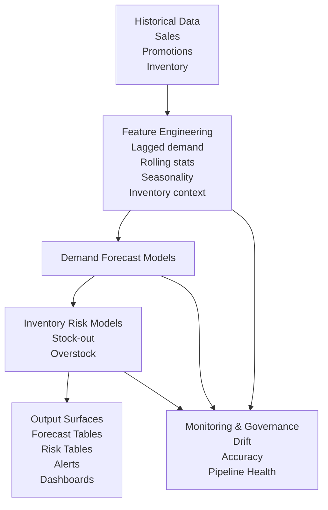
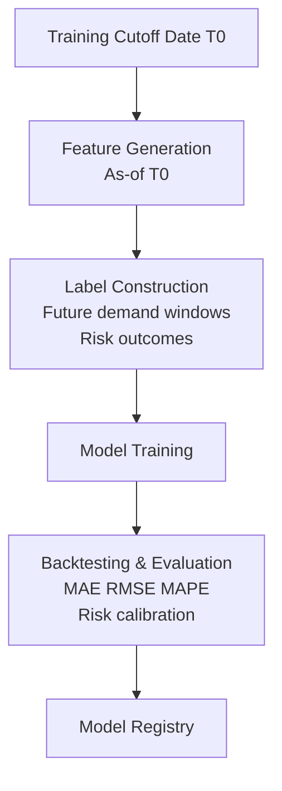
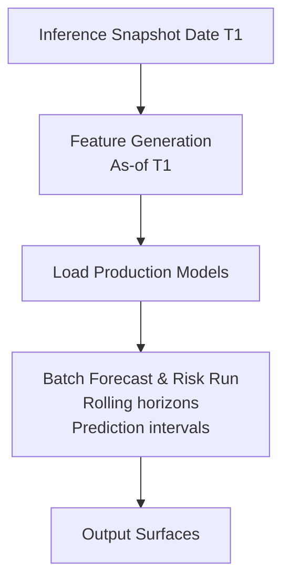

# Demand & Inventory Intelligence System  
## Architecture & Design Document (RFC)

---

## 1. Overview

The Demand & Inventory Intelligence System is a **batch-first predictive analytics platform** designed to forecast SKU-level demand and quantify inventory risks such as **stock-out** and **overstock**.

The system supports:
- Inventory planning
- Procurement decision-making
- Operational risk monitoring

The architecture emphasizes **time-aware computation, modular modeling, uncertainty handling, and operational safety**.

---

## 2. Goals & Non-Goals

### Goals
- Accurate SKU-level demand forecasting
- Early detection of inventory risks
- Reproducible, auditable batch pipelines
- Safe planning-oriented outputs

### Non-Goals
- Real-time inventory control
- Order fulfillment execution
- Pricing optimization
- Supplier negotiation or contracting

---

## 3. High-Level Flow (HLD)

**Historical Data → Feature Engineering → Forecast Models → Risk Models → Output Surfaces → Operations Teams**

---

## 4. Core Architectural Layers

1. Data Sources  
2. Feature Engineering Layer  
3. Modeling Layer  
4. Output & Consumption Layer  
5. Monitoring & Governance  

---

## 5. Data Sources

The system ingests **time-stamped, SKU-aligned batch data**:

- Historical sales (SKU × date)
- Promotion calendars
- Seasonality and calendar signals
- Inventory levels (on-hand, in-transit where available)

All datasets are aligned on **SKU and time**, with explicit cutoff dates to prevent leakage.

---

## 6. Feature Engineering Layer

The feature layer produces **time-aware, snapshot-consistent SKU features** shared across all models.

Key feature groups:
- Lagged demand (t-1, t-7, t-30)
- Rolling statistics (mean, volatility)
- Promotion indicators
- Calendar and seasonality signals
- Inventory coverage metrics (days of supply)

All features are computed **as-of a forecast cutoff date** and reused across training and inference.

---

## 7. Modeling Layer

Models are **independent but coordinated**, sharing the same feature layer.

### Model Types
- **Demand Forecasting**
  - Statistical (ARIMA, ETS)
  - ML (XGBoost, LightGBM)
  - Optional deep models (Temporal CNN / RNN)
- **Stock-out Risk Estimation**
- **Overstock Risk Estimation**
- **Anomaly Detection**
  - Demand spikes/drops
  - Inventory inconsistencies

Each model is:
- Trained independently
- Versioned and registered
- Deployed via batch inference

---

## 8. Output & Consumption Layer

All outputs are **SKU-level, timestamped, and versioned**.

### Output Surfaces
- Forecast tables (point + intervals)
- Risk probability tables
- Alert streams (stock-out / overstock)
- Operations dashboards

These outputs support planners and operations teams—not automated execution systems.

---

## 9. System Architecture (Logical View)

## Training Pipeline

# Inference Pipeline

---

## Design Principles

- Batch-first, planning-oriented design
- Time-awareness and leakage prevention
- Explicit uncertainty handling
- Modular and replaceable components
- No customer-level data usage

---

## Non-Goals

- Real-time inventory control
- Order fulfillment execution
- Pricing optimization
- Supplier negotiation